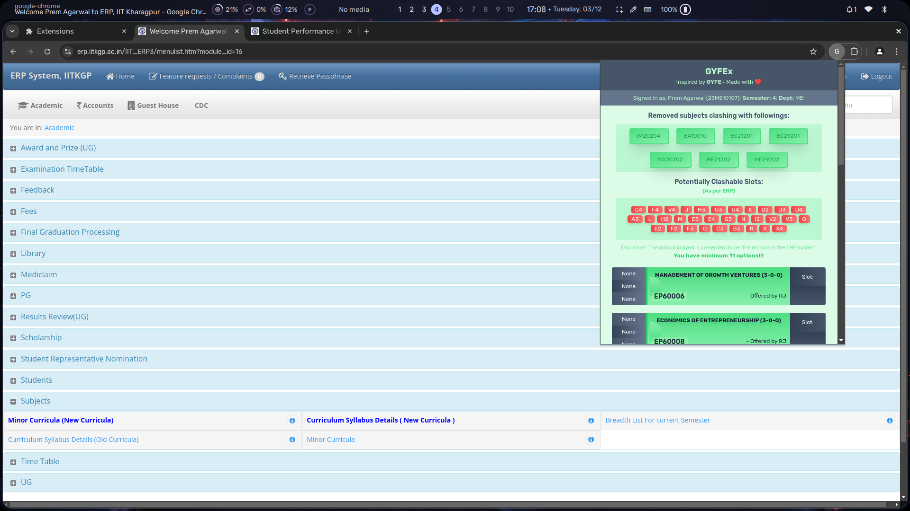

# GYFEx - Get Your Freaking Electives' Extension

GYFEx (Get Your Freaking Electives' Extension) is a lightweight, privacy-focused browser extension inspired by [GYFE](https://github.com/metakgp/gyfe). Some users, who don't feel comfortable entering credentials in the [GYFE Website](https://gyfe.metakgp.org), can try out this browser extension that requires no credentials. Still, I highly encourage you to use [GYFE](https://gyfe.metakgp.org), which lets you download excel files for both depth and breadth, along with subjects to pursue a minor.

---

## Features

- **No Login Required**: Use important features as GYFE without entering credentials.
- **Privacy-Focused**: No data is collected or stored (same as GYFE btw).
- **User-Friendly Interface**: Simple and intuitive to use.

---

## Installation

### For Chromium-based browsers:
1. Open CMD/Terminal/Powershell in your working folder, and run `git clone https://github.com/premagarwals/gyfex`
2. Open `chrome://extensions/` in your chrome browser, or, `brave://extensions/` in your brave browser.
3. Enable "Developer mode" in the top-right corner.
4. Click on `Load Unpacked` in the top-left corner.
5. Go to the `gyfex/dist` in your working folder, then click select/open.

### For Firefox Users:
1. Open CMD/Terminal/Powershell in your working folder, and run `git clone https://github.com/premagarwals/gyfex`
2. Open `about:debugging#/runtime/this-firefox` in your Firefox/Zen etc.
3. Click on `Load Temporary Add-on...` on top.
4. Go to the `gyfex/dist` in your working folder, then select `manifest.json`.
---

## Usage

1. Install the extension following the steps above.
2. Go to ERP and log in there.
3. Open the extension by clicking its icon in your browser toolbar.
4. Use the intuitive interface to perform actions seamlessly without requiring login or additional configuration.

---

## Vision

- [ ] Add support for depth, minors & additionals.
- [ ] Enhance compatibility with less common browsers.
- [ ] Display useful data using Kronos/IQPS or syllabus in one place.

---

## Contributing

Contributions are welcome! To contribute:

1. Fork this repository.
2. Create a new branch: `git checkout -b feature/YourFeatureName`.
3. Make and commit your changes: `git commit -m 'Add YourFeatureName'`.
4. Push to the branch: `git push origin feature/YourFeatureName`.
5. Submit a pull request.

For major changes, please open an issue to discuss what you would like to contribute.

---

## License

This project is licensed under the MIT License. See the [LICENSE](LICENSE) file for details.

---

## Acknowledgements

GYFEx was inspired by GYFE. While GYFE offers powerful features, this extension was created for users who prefer not to log in or share personal credentials.

---

**Disclaimer**: GYFEx is not affiliated with or endorsed by GYFE. This extension was independently developed to provide a login-free alternative.
